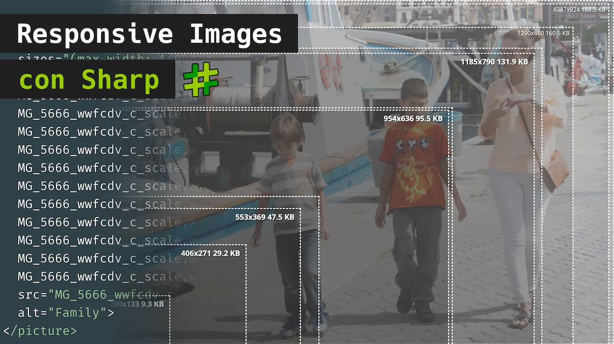

# nucliweb-image-optimization

## Vídeos

- [01 Optimización de Imagenes Responsive con Sharp](https://youtu.be/9-d87Dt-YQg)
## ToDo

- [x] Primera versión del script
- [ ] Extraer la configuración a un archivo externo
- [ ] Publicar la configuración en un paquete NPM
- [ ] Generar componete demo

